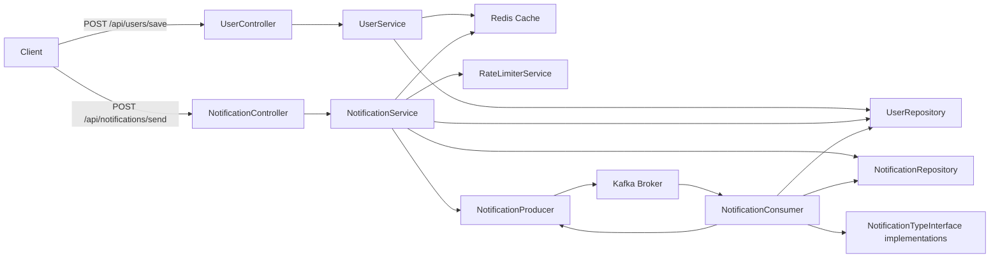

# Notification Service - Project Documentation

## 1. Project Overview

This project is a Spring Boot based notification service that supports:
- user creation and storage
- notification creation
- event-driven notification dispatch via Kafka
- notification retry and dead-letter queue handling
- Redis caching for user lookup
- Redis-based rate limiting
- PostgreSQL persistence for users and notifications
- support for email and SMS notification channels
- centralized exception handling and API response wrapping

## 2. Tech Stack

- Java 17
- Spring Boot 4.0.5
- Spring Data JPA
- Spring Web MVC
- Spring for Apache Kafka
- Spring Data Redis
- Hibernate ORM
- PostgreSQL (runtime)
- H2 (runtime alternative)
- Redis
- Kafka + Zookeeper
- Docker Compose
- Lombok
- java-dotenv

## 3. Architecture

### 3.1 High-level architecture

The service is built in a typical layered architecture:

- **API Layer**: REST controllers receive HTTP requests
- **Service Layer**: business logic for users and notifications
- **Persistence Layer**: JPA repositories for database access
- **Integration Layer**: Kafka producer/consumer, Redis
- **Infrastructure**: scheduling, rate limiting, cache configuration

### 3.2 Component diagram



## 4. Major Modules and Responsibilities

### 4.1 Controllers

#### `UserController`
- Endpoint: `POST /api/users/save`
- Accepts `UserDto`
- Persists user data via `UserService`
- Returns success or error response

#### `NotificationController`
- Endpoint: `POST /api/notifications/send`
- Accepts `NotificationDto`
- Validates/creates notification via `NotificationService`
- Returns wrapped `ApiResponse`

### 4.2 Services

#### `UserService`
- Creates `UserDetail` records
- Saves user data to PostgreSQL
- Caches user lookup results to Redis for `10 minutes`
- Uses `RedisTemplate<String, String>`

#### `NotificationService`
- Validates and creates notification records
- Checks Redis cache for user metadata
- Falls back to DB lookup if cache miss occurs
- Applies rate limiting via `RateLimiterService`
- Sends notification events to Kafka topic `notification-topic`

#### `RateLimiterService`
- Implements token bucket rate limiting in Redis
- Uses `RateLimiterLuaConfig` with a Lua script
- Limits requests to `2 tokens per minute` per user

### 4.3 Kafka Integration

#### `NotificationProducer`
- Publishes `NotificationEvent` messages to Kafka
- Uses `KafkaTemplate<String, NotificationEvent>`
- Sends keyed messages by `userId`

#### `NotificationConsumer`
- Listens to `notification-topic`
- Retrieves user contact data from DB
- Dispatches to `EmailSender` or `SmsSender`
- Handles retry logic and dead-letter queue

### 4.4 Retry Strategy

- Retry count:
  - `HIGH` priority → max `5` retries
  - others → max `3` retries
- Backoff:
  - `baseDelay = 1000ms` for `HIGH`
  - `baseDelay = 5000ms` otherwise
  - exponential backoff: `delay = baseDelay * 2^retryCount`
  - jitter added by random `0-500ms`
- Uses `TaskScheduler` to schedule retry publication
- Sends failed events to `notification-dlq-topic` when retry limit exceeded

### 4.5 Notification channels

#### `NotificationTypeInterface`
- Interface for sender implementations
- Methods:
  - `boolean send(String destination, String message)`
  - `String getType()`

#### `EmailSender`
- Type: `EMAIL`
- Logs email delivery attempt
- Currently simulates failure by returning `false`

#### `SmsSender`
- Type: `SMS`
- Logs SMS delivery attempt
- Returns `true` for success simulation

### 4.6 Configuration

#### `RedisConfig`
- Configures `RedisTemplate<String, Object>`
- Uses `StringRedisSerializer` for keys
- Uses `GenericJackson2JsonRedisSerializer` for values
- Configures `CacheManager`

#### `KafkaConfig`
- Declares Kafka topics:
  - `notification-topic`
  - `notification-retry-topic`
  - `notification-dlq-topic`

#### `SchedulerConfig`
- Configures `TaskScheduler`
- Pool size `5`
- Thread prefix `retry-scheduler-`

#### `RateLimiterLuaConfig`
- Provides a Redis Lua script for token bucket enforcement
- Stores tokens and last refill time in Redis hash
- Uses `HMSET` + `EXPIRE`

## 5. Data Model

### 5.1 UserDetail

- `userId` (String, primary key)
- `emailAddress` (String)
- `phoneNumber` (String)
- Auto-generated UUID on persist

### 5.2 Notification

- `id` (Long, primary key)
- `userId` (String)
- `notificationType` (`EMAIL` or `SMS`)
- `message` (String)
- `retryCount` (Integer)
- `priority` (`HIGH` or `LOW`)
- `status` (`PENDING`, `SUCCESS`, `FAILED`)
- `createdAt` / `updatedAt` timestamps

### 5.3 DTOs

- `UserDto`
  - `userId`
  - `emailAddress`
  - `phoneNumber`

- `NotificationDto`
  - `userId`
  - `message`
  - `type`
  - `priority`

- `NotificationEvent`
  - `notificationId`
  - `NotificationDto`

- `ApiResponse<T>`
  - `success`
  - `message`
  - `data`
  - `errorCode`
  - `timestamp`

## 6. Error Handling

### `GlobalExceptionHandler`
- Handles `UserNotFoundException` → `404 NOT FOUND`
- Handles `RateLimitExceedException` → `429 TOO MANY REQUESTS`
- Handles generic exceptions → `500 INTERNAL SERVER ERROR`
- Returns `ApiResponse` wrapper with error codes

## 7. Environment & Deployment

### 7.1 application.yaml

Important settings:
- PostgreSQL datasource via `DB_URL`, `DB_USERNAME`, `DB_PASSWORD`
- Redis host/port/password via `REDIS_HOST`, `REDIS_PORT`, `REDIS_PASSWORD`
- Kafka bootstrap server `localhost:9092`

### 7.2 .env support

- `.env` can store sensitive values like `REDIS_PASSWORD` and `DB_PASSWORD`
- `NotificationServiceApplication` loads `.env` at startup using `java-dotenv`
- All `.env` variables are set as system properties before Spring starts

### 7.3 Docker Compose

Services defined:
- `zookeeper`
- `kafka`
- `redis` (`redis-stack` with password)

### 7.4 Running locally

1. Start required infra:
   ```bash
   docker compose up -d zookeeper kafka redis
   ```
2. Set `.env` values or environment variables:
   ```bash
   export DB_PASSWORD=yourpassword
   export REDIS_PASSWORD=yourredispassword
   ```
3. Run application:
   ```bash
   mvn spring-boot:run
   ```

## 8. Important design decisions

- **Kafka-backed event-driven notifications** decouple request acceptance from delivery
- **Redis cache** reduces DB lookups for repeated user requests
- **Rate limiting in Redis** protects against abuse and spamming
- **Retry with exponential backoff + jitter** improves reliability when downstream sending fails
- **DLQ support** preserves failed events for later inspection
- **Centralized API response wrapper** standardizes success/error payloads
- **`.env` loading** keeps secrets out of YAML and Git

## 9. Future improvements

- Replace mocked `EmailSender` with real SMTP or email API integration
- Add real SMS gateway integration for `SmsSender`
- Add health checks for Kafka/Redis/PostgreSQL
- Add security/authentication for API endpoints
- Add end-to-end and integration tests for Kafka flow
- Add metrics/monitoring for retry counts and queue depth

## 10. Summary

This project implements a resilient notification system with:
- REST API endpoints for users and notifications
- data persistence and caching
- asynchronous Kafka messaging
- retry and failure handling
- Redis rate limiting
- secure environment-based configuration

It is designed for extendability and production-readiness once real notification delivery providers and monitoring are added.
